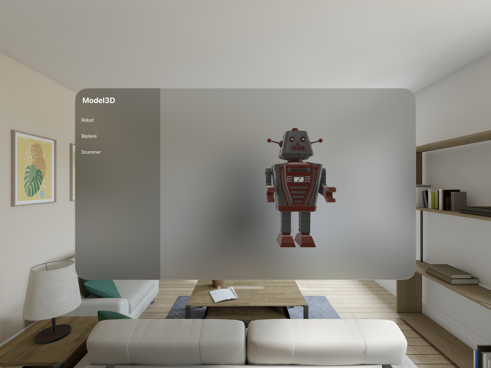
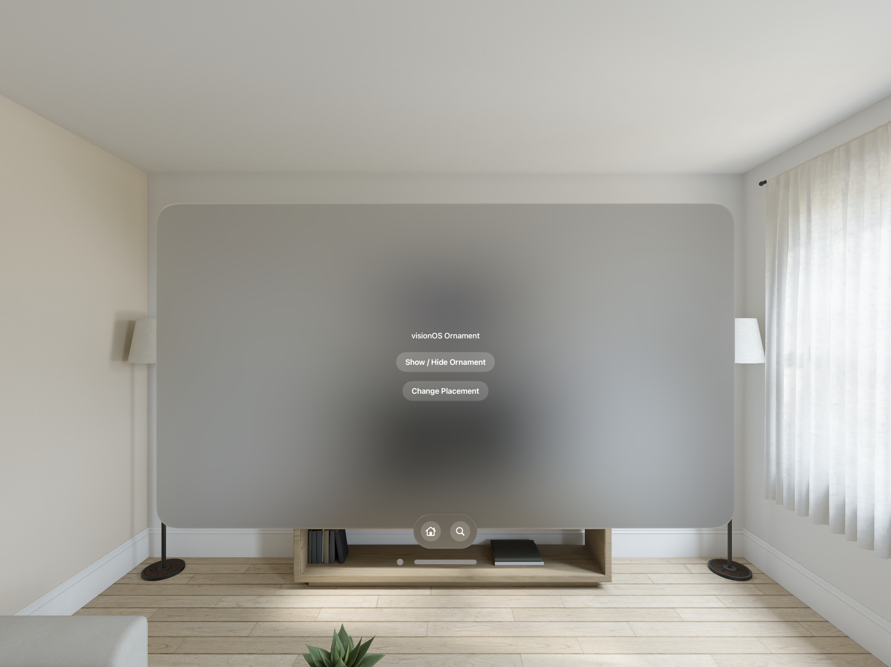

# visionOS Projects

| Item No       | Title         |  Description |  Screenshot |
|    :----:     |    :----:     |    :----:    |    :----:    |
| 1  | [Music Player UI](https://github.com/vinothvino42/MusicPlayerUI-VisionOS)  | A simple music player user interface with Toolbar Bottom Ornament, TabView and NavigationSplitView |  |
| 2  | [Multiple Window App](https://github.com/vinothvino42/MultipleWindowApp)  | To demonstrate how to open a multiple SwiftUI Windows |  |
| 3  | [Volume App](https://github.com/vinothvino42/Volume-App)  | A visionOS app to open a 3D Model with Volume in a Shared space |  |
| 4  | [Model3D API](https://github.com/vinothvino42/Model3D-App)  | Embedding 3D Models from USD Files in visionOS apps with Model3D API |  |
| 5  | [Full-ImmersiveSpace App](https://github.com/vinothvino42/Full-ImmersiveSpace-App)  | A visionOS application with multiple environments built using mesh resources, materials, and textures for a fully rendered and immersive spatial experience |  |
| 6  | [Ornament](https://github.com/vinothvino42/Ornament)  | A visionOS application with ornaments |  |

### Resources
1. [Official visionOS Doc](https://developer.apple.com/documentation/visionOS)
2. [YouTube - Nikhil Jacob](https://www.youtube.com/playlist?list=PLb0SG4T4tfPxyLqiAACwTe6xTfe_iklfA)